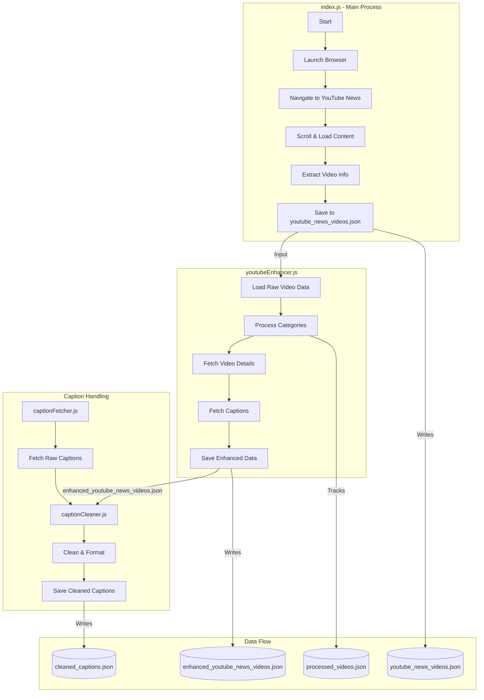
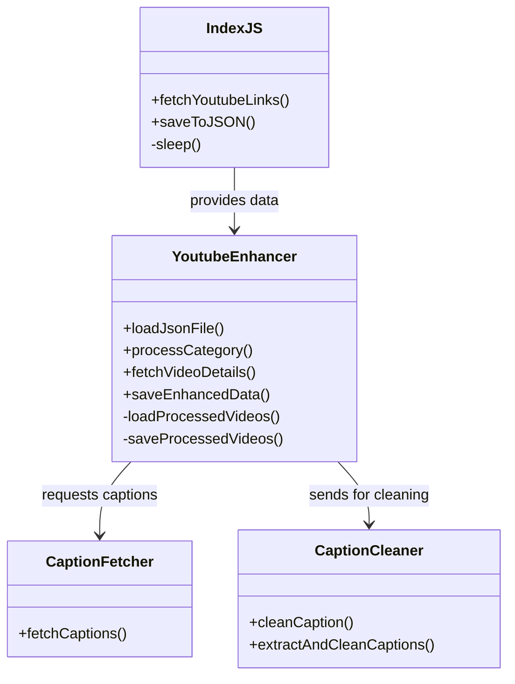
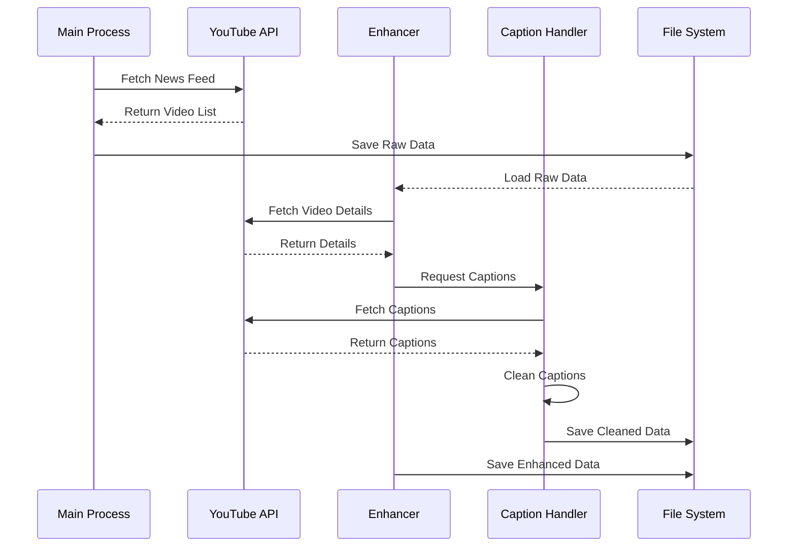

```mermaid
graph TD
    subgraph Main Process [index.js - Main Process]
        A[Start] --> B[Launch Browser]
        B --> C[Navigate to YouTube News]
        C --> D[Scroll & Load Content]
        D --> E[Extract Video Info]
        E --> F[Save to youtube_news_videos.json]
    end

    subgraph Enhancement Process [youtubeEnhancer.js]
        G[Load Raw Video Data] --> H[Process Categories]
        H --> I[Fetch Video Details]
        I --> J[Fetch Captions]
        J --> K[Save Enhanced Data]
    end

    subgraph Caption Processing [Caption Handling]
        L[captionFetcher.js] --> M[Fetch Raw Captions]
        M --> N[captionCleaner.js]
        N --> O[Clean & Format]
        O --> P[Save Cleaned Captions]
    end

    F -->|Input| G
    K -->|enhanced_youtube_news_videos.json| N
    
    subgraph Data Flow
        Q[(youtube_news_videos.json)]
        R[(enhanced_youtube_news_videos.json)]
        S[(cleaned_captions.json)]
        T[(processed_videos.json)]
    end

    F -->|Writes| Q
    K -->|Writes| R
    P -->|Writes| S
    H -->|Tracks| T
```

## Component Relationships

```mermaid
classDiagram
    class IndexJS {
        +fetchYoutubeLinks()
        +saveToJSON()
        -sleep()
    }

    class YoutubeEnhancer {
        +loadJsonFile()
        +processCategory()
        +fetchVideoDetails()
        +saveEnhancedData()
        -loadProcessedVideos()
        -saveProcessedVideos()
    }

    class CaptionFetcher {
        +fetchCaptions()
    }

    class CaptionCleaner {
        +cleanCaption()
        +extractAndCleanCaptions()
    }

    IndexJS --> YoutubeEnhancer : provides data
    YoutubeEnhancer --> CaptionFetcher : requests captions
    YoutubeEnhancer --> CaptionCleaner : sends for cleaning
```

## Data Flow Sequence

```mermaid
sequenceDiagram
    participant M as Main Process
    participant Y as YouTube API
    participant E as Enhancer
    participant C as Caption Handler
    participant F as File System

    M->>Y: Fetch News Feed
    Y-->>M: Return Video List
    M->>F: Save Raw Data
    F-->>E: Load Raw Data
    E->>Y: Fetch Video Details
    Y-->>E: Return Details
    E->>C: Request Captions
    C->>Y: Fetch Captions
    Y-->>C: Return Captions
    C->>C: Clean Captions
    C->>F: Save Cleaned Data
    E->>F: Save Enhanced Data
```
